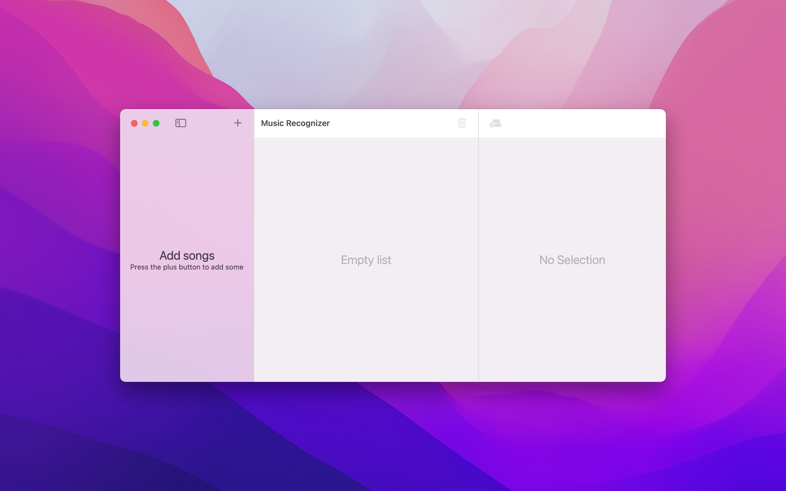
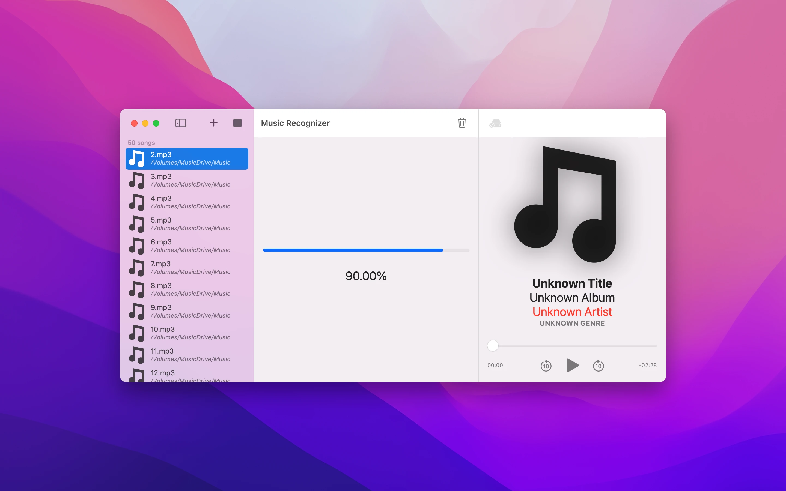
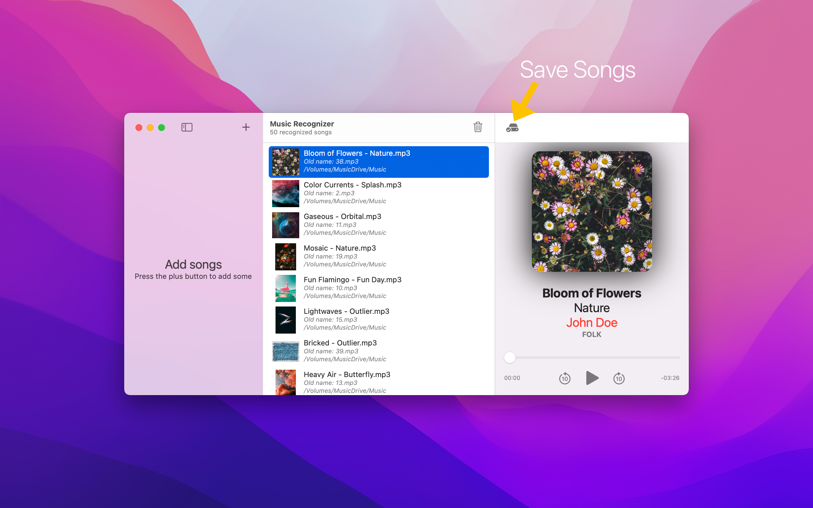
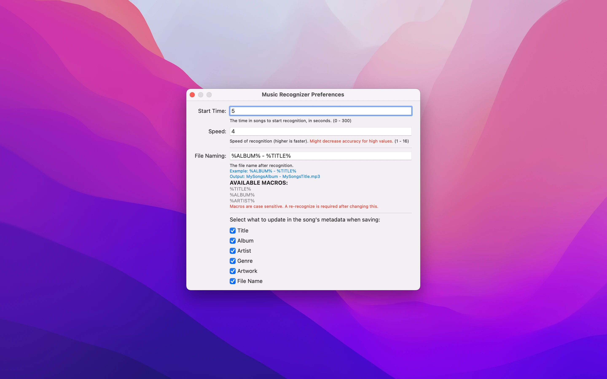

# Documentation
{: #start}
Launching the app will show a window with 3 panels:

The leftmost panel is where you add your songs. The middle panel is where the recognized songs will go. The rightmost panel is where song metadata will be shown, as well as a simple audio player to preview the song.

{: #addSongs}
To add songs, either
1. Press the plus button on the leftmost panel, and select **folders** of songs to add
2. Drag and drop **folders** containing songs

Note: It's important that you only add folders containing songs, and not individual files.

Now it's time to start recognizing your songs. Press the play button on the leftmost panel, and song recognition will start. You can cancel this by pressing the stop button.

Once song recognition is complete, all the recognized songs will be moved from the leftmost panel into the middle panel. Songs that failed to be recognized will stay in the leftmost panel.

Recognized songs will also take on a new file name, that is customizable in Preferences (More info [here](#fileNamingGuide)).

When you're ready to save, press the save button. This will update all recognized songs with the newly found information. You can choose what to update by visiting Preferences. (More info [here](#saveSettingsGuide))

## Customization
Music Recognizer can be easily customized. Here is a guide on each setting:

{: #customizationGuide}
* Recognition Start Time: This specifies the time in songs to start audio recognition (in seconds). For example, if you set a value of 30, then that means Music Recognizer will skip 30 seconds into the song before starting to match audio.

* Recognition Speed: This specifies the speed at which to recognize songs. The larger the value, the faster. Keep in mind that higher values could potentially decrease accuracy, which is why it's set to a default of 4.

{: #fileNamingGuide}
* File Naming: This determines how recognized files will be named. This works by replacing all occurrences of a "macro" with the song data.\
There are 3 available macros: `%TITLE%`, `%ALBUM%`, `%ARTIST%` (case sensitive)\
For example, `%TITLE% - %ARTIST%` would create a file name of `MySongsTitle - MySongsArtist.mp3` (`MySongsTitle` would be the actual name of the song)

{: #saveSettingsGuide}
* Save settings: This determines what fields to update in songs when you press the save button. For example, specify only title & artwork to save only the new title & artwork in songs.
