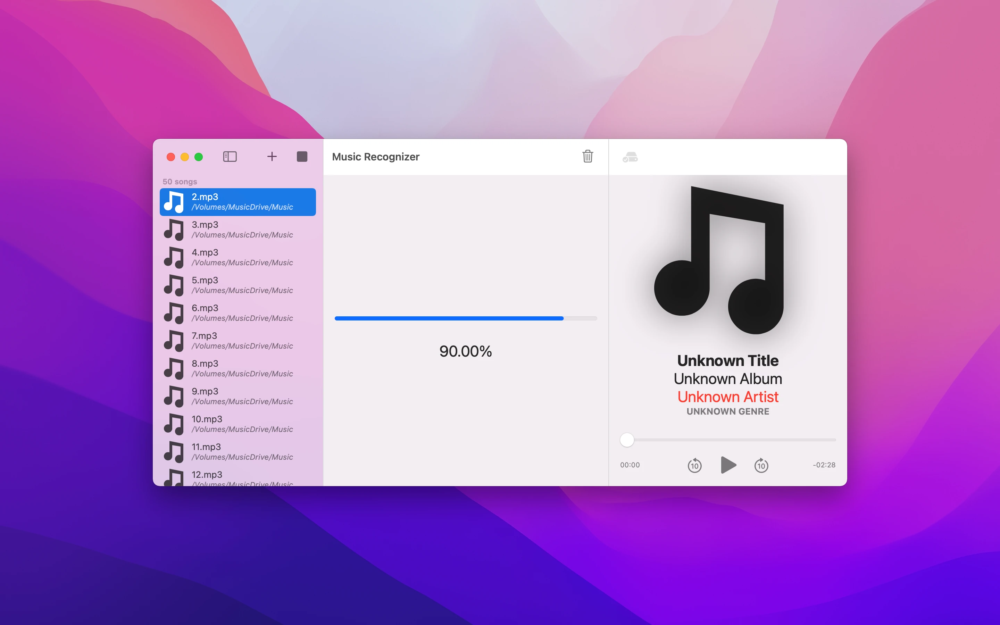

# What is Music Recognizer?
Music Recognizer is an app designed to fix songs that have inaccurate/missing information, like an empty title, missing album, or just blurry artwork.
It goes through each one of your songs, and fixes them with new information gathered with the help of [Apple's Shazam](https://www.shazam.com) for the best accuracy & speed.

## The best accuracy & speed
One of the core reasons of why Music Recognizer was created is because of accuracy. Many other apps with a similar purpose simply just missed too many songs.
Music Recognizer on the other hand has exceptional accuracy, thanks to the engine behind it, [Apple's Shazam](https://www.shazam.com).

In addition, Music Recognizer is also extremely fast. On a 2020 Macbook Air, Music Recognizer can process **500** songs in under a minute!

## Simplicity
One of the main goals of Music Recognizer has always been simplicity. It takes just 3 simple steps to fix your songs!
1. Add your songs
2. Press the start button to start recognizing each song
3. Press the save button to update each song with the newly found information

Thats it!

A built in metadata viewer & audio player is also included, and you can access it by simply clicking on a song.

## Customization
Music Recognizer is easily customizable. By clicking on Music Recognizer -> Preferences, you can change settings such as
* Recognition Start Time, which determines in seconds when to start recognition in a song.
* Recognition Speed, which determines how fast recognition will occur. Higher values might decrease accuracy, however.
* File Naming, which determines how files will be named when you save.
* Save settings, which determines what fields to update in a song when you save.

You can read more about this [here](https://musicrecognizer.github.io/documentation.html#customizationGuide).

## Designed for Mac
Music Recognizer is designed from the ground up for macOS. It is built & optimized for the new M1 chips by Apple, and utilizes macOS Monterey's support for Shazam.
